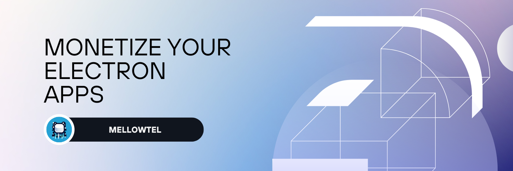

<div align="center"><strong>Mellowtel Electron</strong></div>
<div align="center">Monetize your Electron Apps.<br />Open-Source, Consensual, Transparent.</div>
<br />
<div align="center">
<a href="https://www.mellowtel.com/">Website</a>
<span> · </span>
<a href="https://github.com/mellowtel-inc/mellowtel-electron">GitHub</a>
<span> · </span>
<a href="https://discord.gg/GC8vwpDWC9">Discord</a>
<span> · </span>
<a href="https://docs.mellowtel.com/electron/quickstart">Documentation</a>
</div>

<br/>

<div class="title-block" style="text-align: center;" align="center">


[](https://github.com/prettier/prettier)
[](https://github.com/mellowtel-inc/mellowtel-electron)
[](https://discord.com/invite/GC8vwpDWC9)

</div>

---

# Introduction ℹ️

With Mellowtel's Open-Source library, your users can decide if they want to support you by sharing a fraction of their unused internet bandwidth. Trusted partners — from startups to non-profits — access the internet to retrieve publicly available data, and you get paid for it.

**How?**

Companies need to retrieve publicly available data from the web. You get a share of the revenue they pay for providing access to the web thanks to users that want to support you and share their unused bandwidth.

# Key Features 🎯

- **Easy to use**: Earn from your Electron apps with a few lines of code.
- **Open-source**: The code is open-source and available for everyone to see.
- **Consensual & Opt-out by default**: Users are opted out by default. If they want to support you they have to explicitly opt-in. They can opt-out and manage their settings at any time.
- **Non-intrusive & Private**: In contrast to ads network, we do not collect, share, or sell personal information (not even anonymized data). The whole business model relies on the fact we don't need to collect or sell data but on using a small portion of unused bandwidth
- **Good user experience**: Mellowtel only requires enough resources to open an additional incognito tab. In order to guarantee a good user experience we only operate when the connection is stable (wifi, ethernet) and there is high bandwidth available.

# Getting started 🚀

This guide will help you get Mellowtel up and running in your Electron application.

## 1. Installation

Mellowtel Electron is published on the public npm registry — just install it:

```bash
npm install mellowtel-electron
```

## 2. Implementation

Here's a basic example of how to integrate Mellowtel into your Electron `main.ts` file.

First, import `Mellowtel` and initialize it in your main process file:

```typescript
import { app, BrowserWindow } from 'electron';
import Mellowtel, { setupMellowtelApp } from 'mellowtel-electron';

// Optional: Call BEFORE app.ready to prevent system dialogs
setupMellowtelApp();

// When the app is ready, create the window
app.whenReady().then(async () => {
  let win = createWindow();

  const mellowtel: Mellowtel = new Mellowtel('IDENTIFIER', {
    disableLogs: false
  });

  await mellowtel.requestConsent(win, "Get 3 months free")
  await mellowtel.init()
});
```

Make sure to replace `IDENTIFIER` with the one you get from the Mellowtel dashboard.

### setupMellowtelApp() (Optional)

The `setupMellowtelApp()` function configures Electron command-line flags to prevent system dialogs from interrupting your users. This is optional but recommended for the best user experience.

**Important:** This function must be called **before** `app.whenReady()` to take effect.

```typescript
import Mellowtel, { setupMellowtelApp } from 'mellowtel-electron';

// Call at the top of your main process file, before app.ready
setupMellowtelApp();

app.whenReady().then(async () => {
  // Your app initialization
});
```

**What it does:**
- Disables autofill popups and translation bars
- Prevents Windows Security authentication dialogs (NTLM/Kerberos)
- Disables password manager integration prompts
- Prevents media control overlays
- Suppresses first-run dialogs

This ensures Mellowtel's background operations never interrupt your users' workflow with unexpected system dialogs.

For more detailed documentation, visit [docs.mellowtel.com/electron/quickstart](https://docs.mellowtel.com/electron/quickstart).

## 3. Tracking Request Counts

Mellowtel provides methods to track the number of requests processed with historical data for each day. This allows you to analyze request patterns over time and display statistics to users.

```typescript
const mellowtel = new Mellowtel('IDENTIFIER', { disableLogs: false });

// Get total requests processed since installation
const totalRequests = mellowtel.getTotalRequestCount();
console.log(`Total requests: ${totalRequests}`);

// Get requests processed today
const todayRequests = mellowtel.getDailyRequestCount();
console.log(`Today's requests: ${todayRequests}`);

// Get requests for a specific date
const requestsOnDate = mellowtel.getRequestCountForDate('2025-10-29');
console.log(`Requests on 2025-10-29: ${requestsOnDate}`);

// Get complete daily history
const history = mellowtel.getDailyRequestsHistory();
console.log('All daily counts:', history);
// Output: { '2025-10-25': 15, '2025-10-26': 23, '2025-10-29': 42, ... }

// Get requests for a date range
const last7Days = mellowtel.getRequestCountsInRange('2025-10-22', '2025-10-29');
console.log('Last 7 days:', last7Days);

// Get all information at once
const allCounts = mellowtel.getRequestCounts();
console.log(`Total: ${allCounts.total}`);
console.log(`Today: ${allCounts.daily}`);
console.log(`History:`, allCounts.dailyHistory);
```

**Available Methods:**
- `getTotalRequestCount()`: Returns the total number of requests processed since installation
- `getDailyRequestCount()`: Returns the number of requests processed today
- `getRequestCountForDate(date: string)`: Returns the count for a specific date (YYYY-MM-DD format)
- `getDailyRequestsHistory()`: Returns an object with all dates as keys and their request counts as values
- `getRequestCountsInRange(startDate: string, endDate: string)`: Returns counts for a specific date range
- `getRequestCounts()`: Returns an object with `total`, `daily` (today), and `dailyHistory` (all dates) properties

All request counts are stored locally using `electron-store` and persist across application restarts. Daily counts are stored separately for each date, allowing you to access historical data indefinitely.

# Contributing 🫶

Mellowtel is an open-source project, and contributions are welcome. If you want to contribute, you can create new features, fix bugs, or improve the infrastructure. Please refer to the [CONTRIBUTING.md](https://github.com/mellowtel-inc/mellowtel-js/blob/main/CONTRIBUTING.md) file in the repository for more information on how to contribute.

To see how to contribute, visit [Contribution guidelines](https://github.com/mellowtel-inc/mellowtel-electron/blob/main/CONTRIBUTING.md)

## Publishing for Maintainers 📦

The package is published to the **public npm registry** as [`mellowtel-electron`](https://www.npmjs.com/package/mellowtel-electron). Publishing is intentional — it runs from CI when a GitHub Release is cut, never on a normal push.

### Automated publishing (recommended)

1. Bump the `version` in `package.json` **and** the `VERSION` constant in `src/constants.ts` (used in the websocket connection) to the same value, then merge to `main`.
2. On GitHub, go to **Releases → Draft a new release**, create a tag (e.g. `v1.0.1`), and click **Publish release**.
3. The [`Publish to npm`](.github/workflows/publish.yml) workflow builds and runs `npm publish` automatically. You can also trigger it manually from the **Actions** tab ("Run workflow").

**Required secret:** a repository secret named `NPM_TOKEN` containing an **npm automation token** (npmjs.com → Access Tokens → Generate → *Automation*) for an account that can publish the package. Set it at
`https://github.com/mellowtel-inc/mellowtel-electron/settings/secrets/actions`.

### Manual publishing (fallback)

```bash
npm login          # an account with publish rights to mellowtel-electron
npm run build
npm publish        # publishConfig already sets access: public
```

# Support

You can reach out to us on [Discord](https://discord.gg/GC8vwpDWC9) if you have any questions or need help.

# License 📜

GNU Lesser General Public License v3.0

[License](https://github.com/mellowtel-inc/mellowtel-electron/blob/main/LICENSE.MD)
