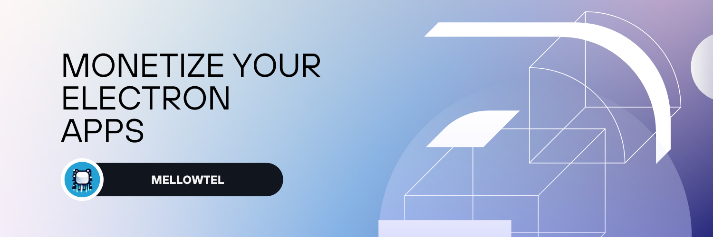

<strong>Mellowtel Electron</strong>

Monetize your Electron Apps. Open-Source, Consensual, Transparent.

 

<a href="https://www.mellowtel.com/">Website</a>
 · 
<a href="https://github.com/mellowtel-inc/mellowtel-electron">GitHub</a>
 · 
<a href="https://discord.gg/GC8vwpDWC9">Discord</a>
 · 
<a href="https://docs.mellowtel.com/electron/quickstart">Documentation</a>

 

---

# Introduction ℹ️

With Mellowtel's Open-Source library, your users can decide if they want to support you by sharing a fraction of their unused internet bandwidth. Trusted partners — from startups to non-profits — access the internet to retrieve publicly available data, and you get paid for it.

**How?**

Companies need to retrieve publicly available data from the web. You get a share of the revenue they pay for providing access to the web thanks to users that want to support you and share their unused bandwidth.

# Key Features 🎯

- **Easy to use**: Earn from your Electron apps with a few lines of code.
- **Open-source**: The code is open-source and available for everyone to see.
- **Consensual & Opt-out by default**: Users are opted out by default. If they want to support you they have to explicitly opt-in. They can opt-out and manage their settings at any time.
- **Non-intrusive & Private**: In contrast to ads network, we do not collect, share, or sell personal information (not even anonymized data). The whole business model relies on the fact we don't need to collect or sell data but on using a small portion of unused bandwidth
- **Good user experience**: Mellowtel only requires enough resources to open an additional incognito tab. In order to guarantee a good user experience we only operate when the connection is stable (wifi, ethernet) and there is high bandwidth available.

# Getting started 🚀

We have moved our documentation to a dedicated website: [docs.mellowtel.com](https://docs.mellowtel.com).

# Quickstart

[Here](https://docs.mellowtel.com/electron/quickstart) is a detailed guide on how to get started with Mellowtel for Electron.

# Contributing 🫶

Mellowtel is an open-source project, and contributions are welcome. If you want to contribute, you can create new features, fix bugs, or improve the infrastructure. Please refer to the [CONTRIBUTING.md](https://github.com/mellowtel-inc/mellowtel-js/blob/main/CONTRIBUTING.md) file in the repository for more information on how to contribute.

To see how to contribute, visit [Contribution guidelines](https://github.com/mellowtel-inc/mellowtel-electron/blob/main/CONTRIBUTING.md)

# Support

You can reach out to us on [Discord](https://discord.gg/GC8vwpDWC9) if you have any questions or need help.

# License 📜

GNU Lesser General Public License v3.0

[License](https://github.com/mellowtel-inc/mellowtel-electron/blob/main/LICENSE.MD)
